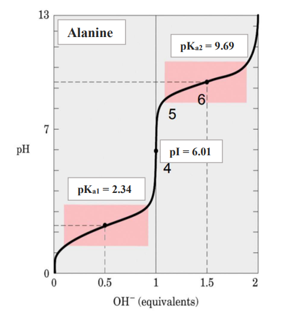
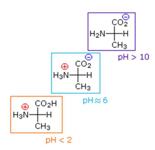
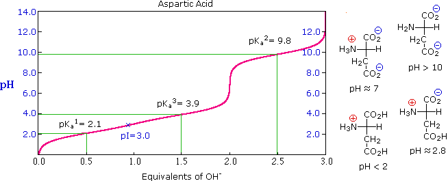
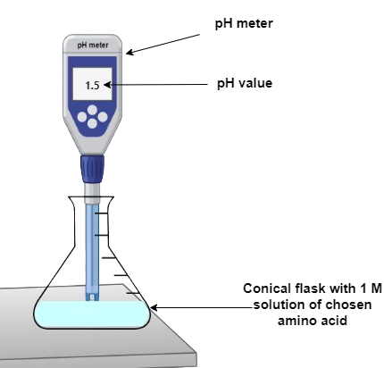
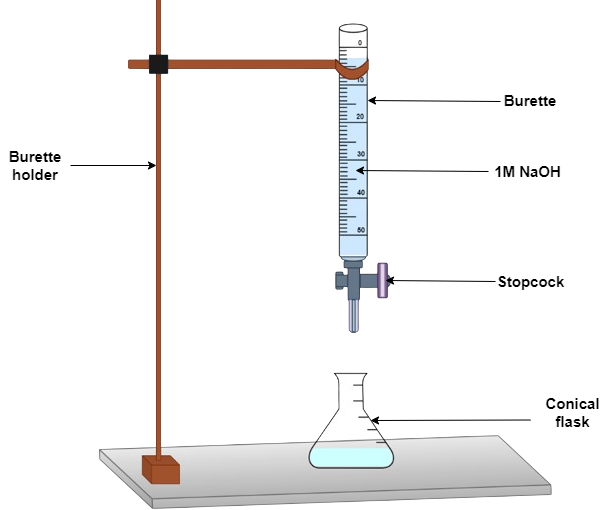

## Procedure
**PART A: Titration of amino acids to determine the isoelectric point.**

**Step 1:** Pipette 10 ml of 0.1 M amino acid solution (such as alanine) into a 50 ml conical flask.  
**Step 2:** Titrate 0.5 ml of 0.1 M HCl from the burette into the amino acid solution and determine the pH of the solution after each addition.  
**Step 3:** Continue adding acid in until pH falls to about 1.3. Record the pH.  
**Step 4:** Wash the electrode in distilled water and titrate 10 ml of alanine solution with 0.1 M NaOH until pH reaches 12.5.  
**Step 5:** Plot a titration curve for alanine as pH versus volume of NaOH used for titration (in ml) or [OH-] equivalence.  
**Step 6:** Similarly, do carry out the titration of arginine (or any other triprotic acid) and plot the titration curve.  
**Step 7:** Determine the pKa and pI values from the plots and compare them with the standard values.  

Titration curve for a diprotic amino acid (Alanine)

Titration curve for a triprotic acidic amino acid (Aspartic acid)

**PART B: Titration of peptides to determine the isoelectric point.**

The same procedure can be carried out to determine the isoelectric point of peptides.

**Determine the isoelectric point of the tripeptide**

**Step 1:** Write out the pKa values of the amino acid from low to high.  
**Step 2:** Drop the pH below the lowest pKa value of the amino acid and determine the net charge of the amino acid.  
**Step 3:** Select a pH between the first and the second pKa value of the amino acid and determine the net charge of the amino acid.  
**Step 4:** Select a pH between the second and the third pKa value of the amino acid and determine the net charge of the amino acid.  
**Step 5:** Raise the pH above the highest pKa value and determine the net charge of the amino acid.  
**Step 6:** Calculate the pI by averaging the two pKa values that are just before and just after the zero net charge.  

## Simulation instrument setup

1. pH measurement

2. Titration

