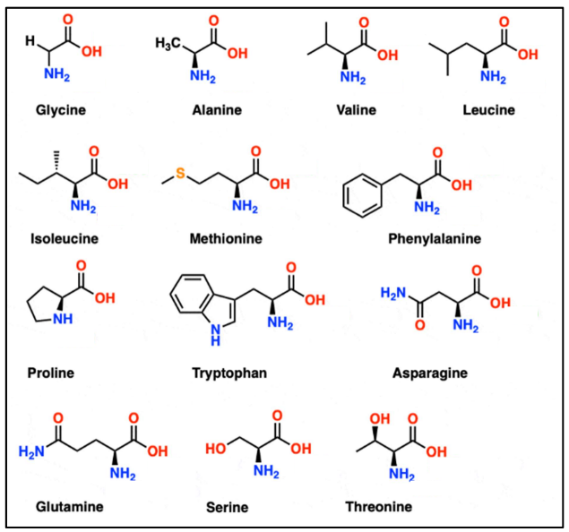
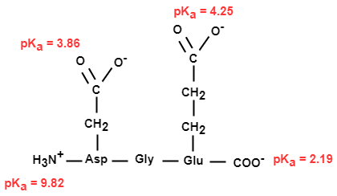

## Theory

Amino acids are amphoteric. They are made of both ionizable acidic (α-carboxylic group) and basic
(α-amino group) moieties. Therefore, they can act as acids as well as an alkali depending on the pH of
the media.

Figure 1: Chemical structure of an amino acid

Based on the properties of the side chain, the amino acids are classified into various types (Figure
2).

Figure 2: Structure of 20 common naturally occurring amino acids

1. Non-polar side-chain – These amino acids do not participate in intermolecular H-bonding with
their side chain (e.g. Alanine).
2. Polar uncharged side-chain – These amino acids have non-ionizable side chains that participate
in intermolecular H-bonding or ionic interactions (e.g. Serine).
3. Charged side-chain – Positively charged NH3+ (e.g. Lys) or negatively charged COO- (e.g. Asp)
side-chains.
At physiological pH, most amino acids exist as zwitterions with both positive and negative
charges. The pH at which the amino acid has equal number of positive and negative charges is
termed as its isoelectric point or pI. At pH values above and and below the pI, the amino acid
bears positive and negative charges respectively (Figure 3).

Figure 3: A typical amino acid with neutral R-group transitions from positively charged
to a zwitterion and then to a negatively charged moiety as pH increases

The zwitterion is a salt formed as a result of the acid-base reactions of the basic amino group
and acidic carboxylic group. The acid-base reactions are the following:
1. Deprotonation (loss of H+) of COOH group as pH increases.
2. Protonation (gain of H+) of NH2 to give NH3+ as pH decreases.

Amino Acid | Side Chain | pKa1   (&alpha;- COOH) | pKa2  (&alpha;-NH 3+) | pKR  (R-group)| pI| Properties |
:--|:--|:--|:--|:--|:--|:--|
Glycine (G)|H|2.34|9.60|-|5.97|Neutral
Alanine (A) | CH3 | 2.34 | 9.69 | - | 6.015 | Neutral
Valine (V) | (CH3)2CH | 2.32 | 9.62 | - | 6.48 | Neutral
Leucine (L) | (CH3)2CHCH2 | 2.36 | 9.60 |  - | 5.98 | Neutral
Isoleucine (I) | CH3CH2CH(CH3) | 2.36 | 9.68 | - | 6.02 | Neutral
Serine (S) | CH2OH | 2.21 | 9.15 | - | 5.68 | Polar, Hydrophilic
Threonine (T) | CH(OH)CH3 | 2.09 | 9.10 | - | 5.595 | Polar, Hydrophilic
Cysteine (C) | SH  | 1.96 | 8.18 | - | 5.07 | Polar, can form disulfide bonds
Methionine (M) | SCH3 | 2.28 | 9.21 | - | 5.74 | Nonpolar
Proline (P) | Fused to α-N | 1.99 | 10.60 | - | 6.295| Unique structure, cyclic
Phenylalanine (F) | C6H5 | 1.83 | 9.13 | - | 5.48 | Nonpolar
Tyrosine (Y) | C6H4OH | 2.20 | 9.11 | 10.07 | 5.655 | Polar, Hydrophilic
Tryptophan (W) | C8H6NCH2 | 2.83 | 9.39 | - | 5.88 | Nonpolar
Histidine (H) | C5H4NCH | 1.82 | 9.17 | 6.00 | 7.585 | Positively charged at neutral pH
Glutamine (Q) | CH2CONH2 | 2.17 | 9.13 | - | 5.65 | Polar, Hydrophilic
Asparagine (N) |CH2CONH2 | 2.02 | 8.80 | - | 5.41 | Polar, Hydrophilic
Glutamic acid (E) | CH2CH2COOH | 2.19 | 9.67 | 4.25 | 3.22 | Negatively charged at neutral pH
Aspartic acid (D) | CH2COOH | 1.88 | 9.60 | 3.65 | 2.765 | Negatively charged at neutral pH
Lysine (K) | CH2CH2CH2NH3+ | 2.18 | 8.95 | 10.53 | 9.74 | Positively charged at neutral pH
Arginine (R) | C4H6N3+(NH)2 | 2.17 | 9.04 | 12.48 | 10.76 | Positively charged at neutral pH

Table 1: The pka values of common α-amino acids grouped based on their charge, polarity, and side
chain properties. (Ref: Adapted from Voet, D. and Voet, J.G. (2010) Biochemistry. 4th Edition, Wiley, Hoboken.)

**How is the isoelectric point of an amino acid determined?**

According to Henderson Hesselbalch equation (Figure 4), the pH equals pKa (the quantitative measure of the strength of an acid) when the concentration of the acid (HA) is the same as that of its conjugate base (A-). Lower pKa values mean a stronger acid. The pKa is the pH at the mid-point of the flat buffering zones in a titration plot (pH vs volume of titrant). Table 1 lists out the pKa and pI values of each amino acid along with their properties.

Figure 4: Henderson Hesselbalch equation

Figure 5: The pI lies between the points A and B where the concentration of an acid is the same as that of its conjugate base

To calculate the pI of a neutral amino acid, an average of the pKa1 and pKa2 values are taken. However, to find the pI of a triprotic acid, the average of the pKa values that are closest to the pH at which the amino acid assumes zero net charge is used (Figure 6).

Figure 6: Calculation of the isoelectric point of amino acids

**How is the isoelectric point of a peptide is determined?**

The isoelectric point of a peptide can be determined in a similar fashion as described above. Let us take the example of a tripeptide Asp-Gly-Glu. The pKa values are listed below. As the pH increases from 1 to 10, the tripeptide transitions from net positive to negative charge. At pH above 2.2, net charge is zero. Therefore, the major contributors of the isoelectric point are the pKa values closest to pH 2.2 i.e. pKa 3.86 and 2.19. Therefore pI is calculated as an average of these 2 pKa values.

<!-- pKa    2.19  3.86  4.25  9.82   -->

pH | 1 | 2.5 | 4 | 5 | 10| 
:--|:--|:--|:--|:--|:--|
Net Charge| +1 | 0 | -1 | -2 | -3 |  

Since zero net charge lies between pH of 2.19 and 3.86,  
Isoelectric point = (2.19 + 3.86)/2 = 3.03

**What is the biological and physiological significance of the amino acid titration curves?**

Understanding the titration curves of amino acids reaches far and wide within the realm of biology and medicine. The knowledge of pH-dependent charge of the constituent amino acids of a protein allows researchers to predict the folding, stability, and interaction of proteins, and unravel deeper insights into enzyme mechanisms.
  

From a clinical perspective, understanding the impact of pH alternations on proteins can influence diagnostic and treatment strategies. A notable example is the disease metabolic acidosis, where a lower blood pH could potentially affect the structure and function of essential proteins. These studies find applications in nutrition and hereditary diseases as they throw light on why some mutations cause disease and others do not or on developing therapeutic strategies that alter protein interactions.